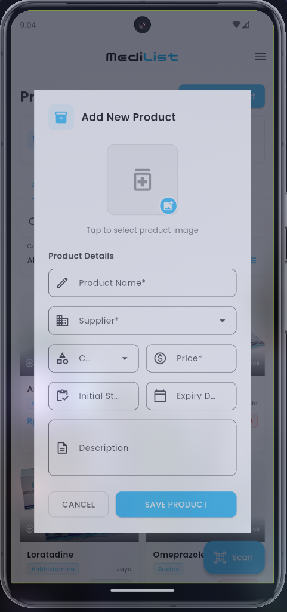

# MediList


## Tentang Proyek

MediList adalah aplikasi manajemen inventaris obat yang dirancang untuk membantu apotek dan fasilitas medis dalam mengelola stok obat mereka. Aplikasi ini dikembangkan sebagai tugas akhir dari mata pelajaran produktif RPL (Rekayasa Perangkat Lunak) di SMK Telkom Malang untuk kelas 11 RPL 3.

**Anggota Tim:**

1. CIPTO YAFIG ADIWONGSO
2. ANDRYANSYAH
3. FADEL MUHAMMAD IZZAT
4. SULTAN MIKAIL ZAKI AL BANI

## Deskripsi Aplikasi

Proyek ini saat ini masih berupa implementasi front-end saja. Meskipun integrasi backend akan sangat meningkatkan fungsionalitas aplikasi, karena keterbatasan waktu, fokus kami adalah pada pembuatan antarmuka pengguna yang komprehensif dan fungsional. Aplikasi ini mendemonstrasikan kemampuan manajemen inventaris termasuk pelacakan produk, manajemen stok, manajemen pemasok, dan pelaporan.

## Unduh Aplikasi

Anda dapat mengunduh dan mencoba aplikasi MediList melalui link berikut:
[Unduh MediList.apk](https://drive.google.com/file/d/1SySufvLLB3GYNKjBtORDDntFACU74rBj/view?usp=sharing)

## Sumber Daya Desain

Proses desain kami meliputi pembuatan mockup dan desain UI terperinci menggunakan Figma:

- [Mockup Board](https://www.figma.com/board/G0YIngtoy02XnqTtZq55sZ/Untitled?node-id=0-1&p=f)
- [Desain Aplikasi](https://www.figma.com/design/LQhY0jEPH4hidmvIZZjEZ7/Tugas-Akhir?node-id=0-1&p=f)

## Struktur Proyek

```bash
lib
-> tree
.
├── core
│   ├── constant.dart
│   ├── themes.dart
│   └── utils.dart
├── main.dart
├── models
│   ├── produk.dart
│   ├── supplier.dart
│   └── user.dart
├── pages
│   ├── auth
│   │   ├── login.dart
│   │   └── signup.dart
│   ├── dashboard
│   │   └── dashboard.dart
│   ├── history
│   │   └── history-page.dart
│   ├── produk
│   │   └── produk-page.dart
│   ├── report
│   │   └── report-page.dart
│   ├── splash-screen
│   │   └── splashscreen.dart
│   ├── stock
│   │   ├── stock-in.dart
│   │   └── stock-out.dart
│   └── supplier
│       └── supplier-page.dart
└── services
    └── api-services.dart

13 directories, 18 files
```

## Fitur Aplikasi

- **Autentikasi**: Login dan registrasi pengguna
- **Dashboard**: Ringkasan informasi penting tentang inventaris
- **Manajemen Produk**: Tambah, edit, lihat detail produk
- **Manajemen Stok**: Pencatatan stok masuk dan stok keluar
- **Manajemen Supplier**: Kelola informasi supplier
- **Riwayat Transaksi**: Lihat dan filter riwayat transaksi stok
- **Laporan**: Generate dan lihat laporan inventaris

## Dokumentasi Aplikasi

### 1. Autentikasi

#### 1.1 Registrasi


#### 1.2 Registrasi Dengan Validasi


#### 1.3 Registrasi Ketika Sukses


#### 1.4 Login


#### 1.5 Login Dengan Validasi


### 2. Dashboard & Navigasi

#### 2.1 Dashboard


#### 2.2 Navigasi


### 3. Manajemen Produk

#### 3.1 Daftar Produk


#### 3.2 Tambah Produk



#### 3.3 Produk Stok Rendah


#### 3.4 Produk Mendekati Kadaluarsa


#### 3.5 Validasi Tambah Stok


#### 3.6 Sukses Tambah Stok


### 4. Manajemen Stok Masuk

#### 4.1 Halaman Stok Masuk


#### 4.2 Tambah Produk Baru


#### 4.3 Pilih Kategori Produk


#### 4.4 Pilih Supplier


#### 4.5 Validasi Tambah Produk


#### 4.6 Sukses Tambah Produk


#### 4.7 Tambah Stok


#### 4.8 Pilih Produk Untuk Tambah Stok


#### 4.9 Validasi Tambah Stok


#### 4.10 Sukses Tambah Stok


### 5. Manajemen Stok Keluar

#### 5.1 Halaman Stok Keluar


#### 5.2 Form Stok Keluar


#### 5.3 Pilih Produk Untuk Stok Keluar


#### 5.4 Validasi Stok Keluar


#### 5.5 Sukses Stok Keluar


### 6. Manajemen Supplier

#### 6.1 Halaman Supplier 1


#### 6.2 Halaman Supplier 2


#### 6.3 Tambah Supplier


#### 6.4 Validasi Tambah Supplier


#### 6.5 Sukses Tambah Supplier


### 7. Riwayat Transaksi

#### 7.1 Semua Riwayat


#### 7.2 Filter Berdasarkan Tanggal


#### 7.3 Riwayat Stok Masuk


#### 7.4 Riwayat Stok Keluar


#### 7.5 Riwayat Pengembalian


#### 7.6 Riwayat Kadaluarsa


#### 7.7 Ringkasan Riwayat


### 8. Laporan

#### 8.1 Halaman Laporan 1


#### 8.2 Halaman Laporan 2


#### 8.3 Halaman Laporan 3


#### 8.4 Filter Laporan Berdasarkan Tanggal


#### 8.5 Lihat Laporan 1


#### 8.6 Lihat Laporan 2


#### 8.7 Ekspor Laporan PDF


## Cara Menjalankan Proyek

1. **Clone repository**:

   ```bash
   git clone https://github.com/flageagle777/MediList.git
   cd MediList
   ```

2. **Persiapan:**

   ```bash
   flutter pub get
   ```

3. **Menjalankan di mode debug**:

   ```bash
   flutter run
   ```

4. **Build aplikasi release**:
   ```bash
   flutter build apk --release
   ```

## Implementasi Teknis

- **State Management**: Penggunaan StatefulWidget dengan manajemen state yang efisien
- **API Integration**: Komunikasi dengan backend menggunakan HTTP client yang dioptimalkan
- **Error Handling**: Penanganan error yang komprehensif dengan feedback visual
- **Form Validation**: Validasi input yang lengkap pada setiap form
- **Session Management**: Penyimpanan dan pengelolaan session pengguna

## Teknologi yang Digunakan

- **Framework**: Flutter
- **Bahasa Pemrograman**: Dart
- **Desain UI/UX**: Figma
- **State Management**: Provider
- **Penyimpanan Lokal**: SharedPreferences

© Terima Kasih
